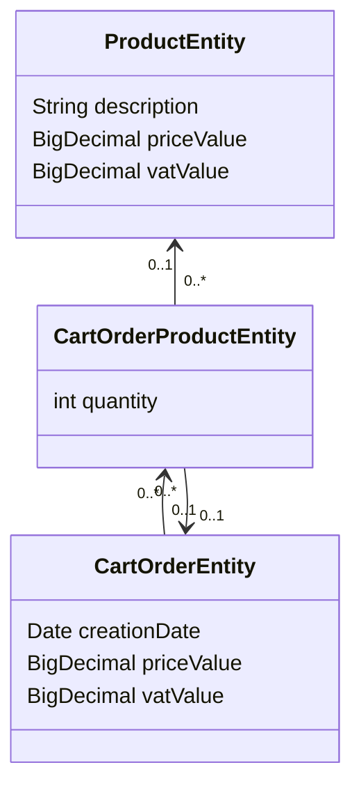

# Purchase-cart-service
it is a demo project where RESTful API endpoint is exposed. It returns pricing information about new order.

JPA persistence model:



## How to (build-test) run

The full directory will be mounted under `/mnt/` folder into the docker image built from [Dockerfile](Dockerfile).
The instructions below address two scenario:
1. Docker used on linux
2. Podman used on windows

### 1. Docker on bash (on ubuntu)

Give executable permissions to files in the scripts folder.
Then build the container image.

```shell
chmod +x scripts/ -R
docker build -t subito/purchase-cart-service . 
```

The folder scripts contains 3 files:

* [build.sh](scripts/build.sh): it executes maven `clean` and `package` phases within the container.
    * `clean`: clean up artifacts created by prior builds
    * `package`: take the compiled code and package it in its distributable format, such as a JAR.
* [tests.sh](scripts/tests.sh): it executes maven `test` phase
    * `test`: test the compiled source code using a suitable unit testing framework
* [run.sh](scripts/run.sh): it executes `java -jar` to run the application

```shell
docker run --rm --name cart_service_build -v "$(pwd)":/mnt -p 9090:9090 -w /mnt subito/purchase-cart-service ./scripts/build.sh
```

```shell
docker run --rm --name cart_service_tests -v "$(pwd)":/mnt -p 9090:9090 -w /mnt subito/purchase-cart-service ./scripts/tests.sh
```

```shell
docker run --rm --name cart_service_run -v "$(pwd)":/mnt -p 9090:9090 -w /mnt subito/purchase-cart-service ./scripts/run.sh
```

- the flag `--rm` is used to delete the container after the task fot it is complete
- the flag `--name` is used to set the container name

Under the root folder are available also `mvnw` scripts:

* Allows anyone who clones / checks-out this repo to build the project without having to install Maven first.
* Ensures that the version of Maven in use is the version with which this project is compatible.

### 2. Podman on powershell (on windows)

Build container image

```shell
podman build -t subito/purchase-cart-service . 
```

Run build script:

```shell
podman run --rm --name cart_service_build -v ${pwd}:/mnt -p 9090:9090 -w /mnt subito/purchase-cart-service scripts/build.sh
```

Run test script:

```shell
podman run --rm --name cart_service_test -v ${pwd}:/mnt -p 9090:9090 -w /mnt subito/purchase-cart-service scripts/tests.sh
```

Run application:

```shell
podman run --rm --name cart_service_run -v ${pwd}:/mnt -p 9090:9090 -w /mnt subito/purchase-cart-service scripts/run.sh
```
N.B. the commands reported for podman may be also suitable for docker Windows users. 
Replace `podman` with `docker` in each command: e.g. `docker build -t subito/purchase-cart-service .`