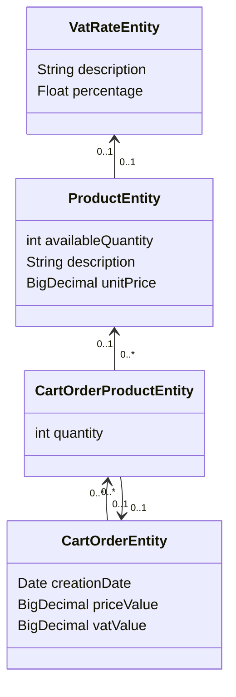

# Purchase-cart-service

This is a demo project where a RESTful API endpoint is exposed. It returns pricing information about new order.

it is based on java (v21) and uses [spring boot](https://spring.io/projects/spring-boot) as framework (v3.4.2).

## Architecture overview

### Model

The application relies on a SQL database.
A brief schema is reported below (JPA persistence model):



The product table stores all details of a product and refers to a vat rate where vat details are stores.
Vat percentages are usually standardized across products, meaning there’s no need to duplicate vat values in the product
table.

The cartOrder table stores details of an order and has a foreign key to cartOrderProduct table,
in which the products present in each order can be found.

### Application

[PurchaseOrderOrchestratorService](src/main/java/com/example/demo/service/implementation/PurchaseOrderOrchestratorService.java)
class is responsible for orchestrating the entire order processing workflow.
It ensures that all steps involved in placing an order are executed in sequence while maintaining transactional
integrity.

#### Key Responsibilities

1. Order Processing Flow Management:
    - Iterates through each step required to complete an order.
    - Executes operations such as product validation, quantity reservation, price calculation, and final order creation.
2. Transactional Consistency:
    - The method executing the order workflow is marked as transactional.
    - If any step fails (e.g., insufficient quantity, database error), all previously performed operations within the
      transaction are rolled back, preventing inconsistent or partial order states.

## How to (build-test) run

The full directory will be mounted under `/mnt/` folder into the docker image built from [Dockerfile](Dockerfile).
The instructions below address two scenario:

1. Docker used on linux
2. Podman used on windows

### 1. Docker on bash (on ubuntu)

From the root of the project folder,
give executable permissions to files in the [scripts](scripts) folder.
Afterward, build the container image.

```shell
chmod +x scripts/ -R
docker build -t subito/purchase-cart-service . 
```

The folder scripts contains 3 files:

* [build.sh](scripts/build.sh): it executes maven `clean` and `package` phases within the container.
    * `clean`: clean up artifacts created by prior builds
    * `package`: take the compiled code and package it in its distributable format, such as a JAR.
* [tests.sh](scripts/tests.sh): it executes maven `test` phase
    * `test`: test the compiled source code using a suitable unit testing framework
* [run.sh](scripts/run.sh): it executes `java -jar` to run the application

Run build script:

```shell
docker run --rm --name cart_service_build -v "$(pwd)":/mnt -p 9090:9090 -w /mnt subito/purchase-cart-service ./scripts/build.sh
```

Run test script:

```shell
docker run --rm --name cart_service_tests -v "$(pwd)":/mnt -p 9090:9090 -w /mnt subito/purchase-cart-service ./scripts/tests.sh
```

Run application:

```shell
docker run --rm --name cart_service_run -v "$(pwd)":/mnt -p 9090:9090 -w /mnt subito/purchase-cart-service ./scripts/run.sh
```

- the flag `--rm` is used to delete the container when the task is complete
- the flag `--name` is used to set the container name

In the root folder `mvnw` scripts ara available:

* Allows anyone who clones / checks-out this repo to build the project without having to install Maven first.
* Ensures that the version of Maven in use is the version with which this project is compatible.

### 2. Podman on powershell (on windows)

From the root of the project folder, build container image:

```shell
podman build -t subito/purchase-cart-service . 
```

Run build script:

```shell
podman run --rm --name cart_service_build -v ${pwd}:/mnt -p 9090:9090 -w /mnt subito/purchase-cart-service scripts/build.sh
```

Run test script:

```shell
podman run --rm --name cart_service_test -v ${pwd}:/mnt -p 9090:9090 -w /mnt subito/purchase-cart-service scripts/tests.sh
```

Run application:

```shell
podman run --rm --name cart_service_run -v ${pwd}:/mnt -p 9090:9090 -w /mnt subito/purchase-cart-service scripts/run.sh
```

N.B. the commands reported for podman should be suitable for docker Windows users also.
Replace `podman` with `docker` in every command: e.g. `docker build -t subito/purchase-cart-service .`

### Test structure

Test directory structure reflects the [src](src/main/java/com/example/demo) directory structure.
Each class presenting business logic is tested using unit tests (the ones annotated with
`@ExtendWith(MockitoExtension.class)`).

Class [PurchaseOrderOrchestratorService](src/main/java/com/example/demo/service/implementation/PurchaseOrderOrchestratorService.java)
is also covered by integration tests to validate the purchase order flow.

Class [PurchaseOrderController](src/main/java/com/example/demo/controller/PurchaseOrderController.java) is covered by
end-to-end tests:
a http call to the exposed endpoint _'/api/v1/order'_  is simulated and the response data are validated.

N.B. classes annotated with `@SpringBootTest` load database data from the
[populate-products-test](src/test/resources/data/populate-products-test.sql) sql file.

### Data insertion

The application code doesn't know the database implementation. For the seek of this project an in-memory database is
used.

Each time the application runs, it initializes the schema on startup from configuration properties of the main Hibernate
EntityManagerFactory based on standard JPA properties and HibernateSettings.
On exit, it cleans all the schema (drops the tables).
This behavior can be customized in the [application.properties](src/main/resources/application.properties) file.

Database data are populated by [populate-products](src/main/resources/data/populate-products.sql) sql file.
This file should be populated with insert statements to add new data. 
